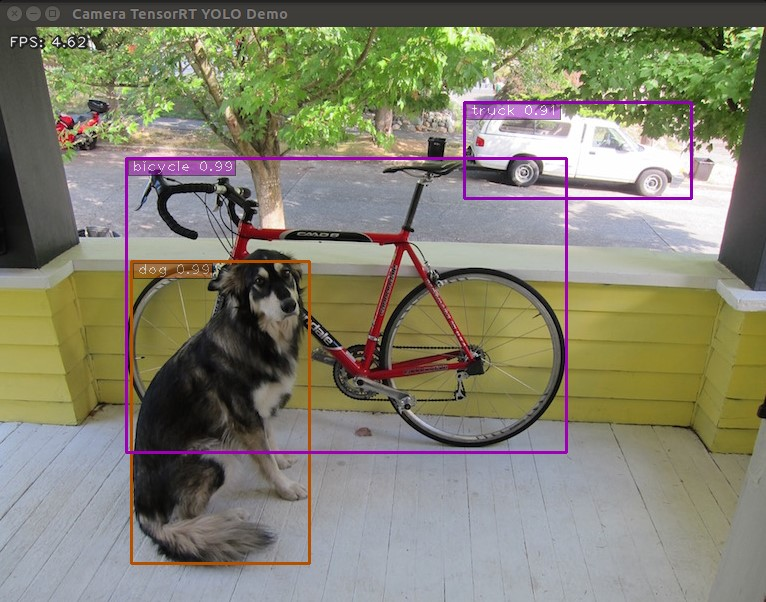

# This repository is based on JK-Jung's TensorRT demos. It serves as a backup of my files, and is not intended to be immediately cloned and run by anyone.

# To run this repository please use the following commands:

source deepsort_env/bin/activate
python3 trt_yolo_final_pymysql.py -m yolov4-tiny-synth-mk1 --ub 0 --height 720 --width 1280

# Sections from JK-Jung's README

# tensorrt_demos

Examples demonstrating how to optimize Caffe/TensorFlow/DarkNet/PyTorch models with TensorRT and do inference on NVIDIA Jetson or x86_64 platforms.  Highlights:

* Run an optimized "yolov4-416" object detector at ~4.6 FPS on Jetson Nano.

Table of contents
-----------------
* [Demo #5: YOLOv4](#yolov4)


<a name="prerequisite"></a>
Prerequisite
------------

The code in this repository was tested on Jetson Nano, TX2, and Xavier NX DevKits.  In order to run the demos below, first make sure you have the proper version of image (JetPack) installed on the target Jetson system.  For example, [Setting up Jetson Nano: The Basics](https://jkjung-avt.github.io/setting-up-nano/) and [Setting up Jetson Xavier NX](https://jkjung-avt.github.io/setting-up-xavier-nx/).

More specifically, the target Jetson system must have TensorRT libraries installed.

* Demo #1 and Demo #2: works for TensorRT 3.x+,
* Demo #3: requires TensoRT 5.x+,
* Demo #4 and Demo #5: requires TensorRT 6.x+.
* Demo #6 part 1: INT8 requires TensorRT 6.x+ and only works on GPUs with CUDA compute 6.1+.
* Demo #6 part 2: DLA core requires TensorRT 7.x+ (is only tested on Jetson Xavier NX).
* Demo #7: requires TensorRT 7.x+.

You could check which version of TensorRT has been installed on your Jetson system by looking at file names of the libraries.  For example, TensorRT v5.1.6 (JetPack-4.2.2) was present on one of my Jetson Nano DevKits.

```shell
$ ls /usr/lib/aarch64-linux-gnu/libnvinfer.so*
/usr/lib/aarch64-linux-gnu/libnvinfer.so
/usr/lib/aarch64-linux-gnu/libnvinfer.so.5
/usr/lib/aarch64-linux-gnu/libnvinfer.so.5.1.6
```

Furthermore, all demo programs in this repository require "cv2" (OpenCV) module for python3.  You could use the "cv2" module which came in the JetPack.  Or, if you'd prefer building your own, refer to [Installing OpenCV 3.4.6 on Jetson Nano](https://jkjung-avt.github.io/opencv-on-nano/) for how to build from source and install opencv-3.4.6 on your Jetson system.

If you plan to run Demo #3 (SSD), you'd also need to have "tensorflow-1.x" installed.  You could probably use the [official tensorflow wheels provided by NVIDIA](https://docs.nvidia.com/deeplearning/frameworks/pdf/Install-TensorFlow-Jetson-Platform.pdf), or refer to [Building TensorFlow 1.12.2 on Jetson Nano](https://jkjung-avt.github.io/build-tensorflow-1.12.2/) for how to install tensorflow-1.12.2 on the Jetson system.

Or if you plan to run Demo #4 and Demo #5, you'd need to have "protobuf" installed.  I recommend installing "protobuf-3.8.0" using my [install_protobuf-3.8.0.sh](https://github.com/jkjung-avt/jetson_nano/blob/master/install_protobuf-3.8.0.sh) script.  This script would take a couple of hours on a Jetson system.  Alternatively, pip3 install a recent version of "protobuf" should also work (but might run a little bit slowlier).

I use Python 3.6 as my primary test environment.  I think other versions of python3 would likely just work without any problem.

In case you are setting up a Jetson Nano or Jetson Xavier NX from scratch to run these demos, you could refer to the following blog posts.  They contain the exact steps I applied when I did the testing of JetPack-4.3 and JetPack-4.4.

* [JetPack-4.5](https://jkjung-avt.github.io/jetpack-4.5/)
* [Setting up Jetson Xavier NX](https://jkjung-avt.github.io/setting-up-xavier-nx/)
* [JetPack-4.4 for Jetson Nano](https://jkjung-avt.github.io/jetpack-4.4/)
* [JetPack-4.3 for Jetson Nano](https://jkjung-avt.github.io/jetpack-4.3/)

<a name="yolov4"></a>
Demo #5: YOLOv4
---------------

Along the same line as Demo #3, these 2 demos showcase how to convert pre-trained yolov3 and yolov4 models through ONNX to TensorRT engines.  The code for these 2 demos has gone through some significant changes.  More specifically, I have recently updated the implementation with a "yolo_layer" plugin to speed up inference time of the yolov3/yolov4 models.

My current "yolo_layer" plugin implementation is based on TensorRT's [IPluginV2IOExt](https://docs.nvidia.com/deeplearning/tensorrt/api/c_api/classnvinfer1_1_1_i_plugin_v2_i_o_ext.html).  It only works for **TensorRT 6+**.  I'm thinking about updating the code to support TensorRT 5 if I have time late on.

I developed my "yolo_layer" plugin by referencing similar plugin code by [wang-xinyu](https://github.com/wang-xinyu/tensorrtx/tree/master/yolov4) and [dongfangduoshou123](https://github.com/dongfangduoshou123/YoloV3-TensorRT/blob/master/seralizeEngineFromPythonAPI.py).  So big thanks to both of them.

Assuming this repository has been cloned at "${HOME}/project/tensorrt_demos", follow these steps:

1. Install "pycuda" in case you haven't done so in Demo #3.  Note that the installation script resides in the "ssd" folder.

   ```shell
   $ cd ${HOME}/project/tensorrt_demos/ssd
   $ ./install_pycuda.sh
   ```

2. Install **version "1.4.1" (not the latest version)** of python3 **"onnx"** module.  Note that the "onnx" module would depend on "protobuf" as stated in the [Prerequisite](#prerequisite) section.  Reference: [information provided by NVIDIA](https://devtalk.nvidia.com/default/topic/1052153/jetson-nano/tensorrt-backend-for-onnx-on-jetson-nano/post/5347666/#5347666).

   ```shell
   $ sudo pip3 install onnx==1.4.1
   ```

3. Go to the "plugins/" subdirectory and build the "yolo_layer" plugin.  When done, a "libyolo_layer.so" would be generated.

   ```shell
   $ cd ${HOME}/project/tensorrt_demos/plugins
   $ make
   ```

4. Download the pre-trained yolov3/yolov4 COCO models and convert the targeted model to ONNX and then to TensorRT engine.  I use "yolov4-416" as example below.  (Supported models: "yolov3-tiny-288", "yolov3-tiny-416", "yolov3-288", "yolov3-416", "yolov3-608", "yolov3-spp-288", "yolov3-spp-416", "yolov3-spp-608", "yolov4-tiny-288", "yolov4-tiny-416", "yolov4-288", "yolov4-416", "yolov4-608", "yolov4-csp-256", "yolov4-csp-512", "yolov4x-mish-320", "yolov4x-mish-640", and [custom models](https://jkjung-avt.github.io/trt-yolo-custom-updated/) such as "yolov4-416x256".)

   ```shell
   $ cd ${HOME}/project/tensorrt_demos/yolo
   $ ./download_yolo.sh
   $ python3 yolo_to_onnx.py -m yolov4-416
   $ python3 onnx_to_tensorrt.py -m yolov4-416
   ```

   The last step ("onnx_to_tensorrt.py") takes a little bit more than half an hour to complete on my Jetson Nano DevKit.  When that is done, the optimized TensorRT engine would be saved as "yolov4-416.trt".

   In case "onnx_to_tensorrt.py" fails (process "Killed" by Linux kernel), it could likely be that the Jetson platform runs out of memory during conversion of the TensorRT engine.  This problem might be solved by adding a larger swap file to the system.  Reference: [Process killed in onnx_to_tensorrt.py Demo#5](https://github.com/jkjung-avt/tensorrt_demos/issues/344).

5. Test the TensorRT "yolov4-416" engine with the "dog.jpg" image.

   ```shell
   $ cd ${HOME}/project/tensorrt_demos
   $ wget https://raw.githubusercontent.com/pjreddie/darknet/master/data/dog.jpg -O ${HOME}/Pictures/dog.jpg
   $ python3 trt_yolo.py --image ${HOME}/Pictures/dog.jpg \
                         -m yolov4-416
   ```

   This is a screenshot of the demo against JetPack-4.4, i.e. TensorRT 7.

   

6. The "trt_yolo.py" demo program could also take various image inputs.  Refer to step 5 in Demo #1 again.

   For example, I tested my own custom trained ["yolov4-crowdhuman-416x416"](https://github.com/jkjung-avt/yolov4_crowdhuman) TensorRT engine with the "Avengers: Infinity War" movie trailer:

   [](https://youtu.be/7Qr_Fq18FgM)

7. (Optional) Test other models than "yolov4-416".

8. (Optional) If you would like to stream TensorRT YOLO detection output over the network and view the results on a remote host, check out my [trt_yolo_mjpeg.py example](https://github.com/jkjung-avt/tensorrt_demos/issues/226).

9. Similar to step 5 of Demo #3, I created an "eval_yolo.py" for evaluating mAP of the TensorRT yolov3/yolov4 engines.  Refer to [README_mAP.md](README_mAP.md) for details.

   ```shell
   $ python3 eval_yolo.py -m yolov3-tiny-288
   $ python3 eval_yolo.py -m yolov4-tiny-416
   ......
   $ python3 eval_yolo.py -m yolov4-608
   $ python3 eval_yolo.py -l -m yolov4-csp-256
   ......
   $ python3 eval_yolo.py -l -m yolov4x-mish-640
   ```
Licenses
--------

1. I referenced source code of [NVIDIA/TensorRT](https://github.com/NVIDIA/TensorRT) samples to develop most of the demos in this repository.  Those NVIDIA samples are under [Apache License 2.0](https://github.com/NVIDIA/TensorRT/blob/master/LICENSE).
2. [GoogLeNet](https://github.com/BVLC/caffe/tree/master/models/bvlc_googlenet): "This model is released for unrestricted use."
3. [MTCNN](https://github.com/PKUZHOU/MTCNN_FaceDetection_TensorRT): license not specified.  Note [the original MTCNN](https://github.com/kpzhang93/MTCNN_face_detection_alignment) is under [MIT License](https://github.com/kpzhang93/MTCNN_face_detection_alignment/blob/master/LICENSE).
4. [TensorFlow Object Detection Models](https://github.com/tensorflow/models/tree/master/research/object_detection): [Apache License 2.0](https://github.com/tensorflow/models/blob/master/LICENSE).
5. YOLOv3/YOLOv4 models ([DarkNet](https://github.com/AlexeyAB/darknet)): [YOLO LICENSE](https://github.com/AlexeyAB/darknet/blob/master/LICENSE).
6. [MODNet](https://github.com/ZHKKKe/MODNet): [Creative Commons Attribution NonCommercial ShareAlike 4.0](https://creativecommons.org/licenses/by-nc-sa/4.0/legalcode) license.
7. For the rest of the code (developed by jkjung-avt and other contributors): [MIT License](https://github.com/jkjung-avt/tensorrt_demos/blob/master/LICENSE).


NOTE:

To run this repository please use the following commands:

source deepsort_env/bin/activate
python3 trt_yolo_final_pymysql.py -m yolov4-tiny-synth-mk1 --ub 0 --height 720 --width 1280
